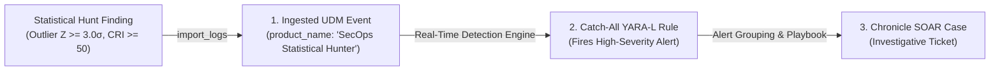

# 🤝 Clean Hand-Off (CH) & Synthetic UDM Event Ingestion Architecture

**Author**: Greg Kushmerek  
**Skill**: `secops-statistical-hunter`

The **Clean Hand-Off (CH)** protocol defines the standardized data contract produced by the **SecOps Statistical Outlier Hunter**. It powers automated ingestion into the Google SecOps Event Store and enables direct interactive escalation into Google SecOps Cases.

---

## 1. 🏛️ The Event-to-Alert-to-Case Promotion Lifecycle

Pushing a statistical hunt finding does **not** directly create a case via a backdoor API; it natively leverages Google SecOps's event-driven detection pipeline:



### 1:1 Ingestion Cardinality Standard:
* **One Event Per Outlier Entity**: Exactly **1 synthetic UDM event is emitted per outlier entity** that breached statistical significance thresholds ($Z \ge 3.0\sigma$, $\text{CRI} \ge 50$). 
* **Zero Noise on Nominal Fleet**: Non-outlier entities ($Z < 2.0\sigma$) are never ingested.
* **Shared Campaign Binding**: When multiple outliers are flagged in a single hunt sweep, each event shares a common `target.resource.attribute.labels: [{"key": "Hunt Campaign ID", "value": "<campaign_id>"}]`.

### 🚫 Strict Anti-Case-Comment Pollution Prohibition (With Active Case Exception):
* **No Arbitrary Case Hijacking**: When an analyst requests general escalation (*"Send a report about this to Google SecOps"*, *"Escalate to SecOps"*, or *"Log in Chronicle"*), the agent is **STRICTLY PROHIBITED** from calling `create_case_comment` or `list_cases` to attach hunt summaries to arbitrary open cases.
* **Carved-Out Active Case Exception (Path B)**: If the analyst is actively reviewing a specific case and explicitly instructs the agent to attach the findings to that specific case (e.g. *"Attach this finding to Case 11075"*, *"Add this report to the case wall of Case 11075"*), the agent is authorized to call `create_case_comment(case_id="<ID>", comment=...)` targeting that explicitly designated case.
* **Mandatory Default Path (Path A)**: When no specific Case ID is requested, the agent MUST generate the synthetic UDM event JSON, preview it to the user, and ingest it via `import_logs` upon authorization.

---

## 2. 🛡️ The Chronicle Catch-All Case Promotion Rule

To automatically promote ingested synthetic events into **Alerts** and **SOAR Cases**, the tenant maintains this persistent detection rule:

```yara
rule secops_statistical_hunter_alert_catchall {
  meta:
    author = "Greg Kushmerek"
    description = "Catches synthetic statistical hunter outlier findings and promotes them to Alerts/Cases"
    severity = "HIGH"

  events:
    $e.metadata.product_name = "SecOps Statistical Hunter"
    $e.metadata.event_type = "GENERIC_EVENT"
    $e.security_result.risk_score >= 50

    // Bind entity for case grouping
    $user = $e.principal.user.userid
    $host = $e.principal.asset.hostname

  match:
    $user, $host over 5m

  outcome:
    $risk_score = max($e.security_result.risk_score)
    $model = array_distinct($e.target.resource.attribute.labels.value)
    $summary = array_distinct($e.security_result.summary)
    $commands = array_distinct($e.security_result.detection_fields["sample_commands"])

  condition:
    $e
}
```

---

## 3. 📋 The Canonical Synthetic UDM Event Schema

Every emitted synthetic event encapsulates the **6 Evidence Pillars**:

```json
{
  "udm": {
    "metadata": {
      "event_timestamp": "2026-08-26T21:00:00Z",
      "ingested_timestamp": "2026-08-26T21:00:00Z",
      "product_name": "SecOps Statistical Hunter",
      "vendor_name": "Google SecOps",
      "event_type": "GENERIC_EVENT",
      "product_event_type": "VOLUMETRIC_BASELINE_ANOMALY",
      "description": "Process Execution Surge: host-042 breached parametric baseline by +4.82σ (CRI: 74)"
    },
    "principal": {
      "hostname": "host-042.corp.local",
      "asset": { "hostname": "host-042.corp.local" }
    },
    "target": {
      "resource": {
        "name": "VOLUMETRIC_BASELINE_ANOMALY",
        "resource_type": 0,
        "attribute": {
          "labels": [
            { "key": "Statistical Model", "value": "Parametric Historical Z-Score" },
            { "key": "1. Observed Activity", "value": "850 executions" },
            { "key": "2. Baseline History", "value": "168 hourly intervals" },
            { "key": "3. Typical Normal Level", "value": "250.0" },
            { "key": "4. Normal Daily Spread", "value": "±35.0" },
            { "key": "5. Company-Wide Breadth", "value": "1 host" },
            { "key": "6. Distinct Programs", "value": "42 unique binaries" },
            { "key": "Raw Score", "value": "+4.82σ" },
            { "key": "Calibrated Risk Index", "value": "74" }
          ]
        }
      }
    },
    "security_result": [
      {
        "risk_score": 74,
        "severity": "HIGH",
        "summary": "Host host-042 performed 850 process executions, exceeding normal baseline (250 ± 35) by +4.82σ (CRI: 74).",
        "detection_fields": [
          { "key": "mitre_tactics", "value": "TA0002_EXECUTION" },
          { "key": "mitre_techniques", "value": "T1059" }
        ]
      }
    ]
  }
}
```
