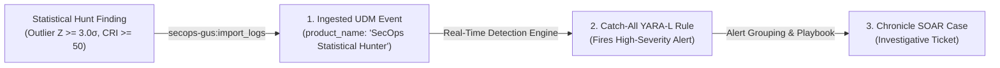

# 🤝 Clean Hand-Off (CH) & Synthetic UDM Event Ingestion Architecture

**Author**: Greg Kushmerek  
**Skill**: `secops-statistical-hunter`  
**Specification**: Google Cloud Chronicle UDM & SecOps Ingestion Standard  
**Companion Module**: `scripts/clean_handoff.py`

The **Clean Hand-Off (CH)** protocol defines the standardized data contract produced by the **SecOps Statistical Outlier Hunter**. It powers automated ingestion into the Google SecOps Event Store and enables direct interactive escalation into Google SecOps Cases.

---

## 1. 🏛️ The Event-to-Alert-to-Case Promotion Lifecycle

Pushing a statistical hunt finding does **not** directly create a case via a backdoor API; it natively leverages Google SecOps's event-driven detection pipeline:


```mermaid
flowchart LR
    A["Statistical Hunt Finding<br>(Outlier Z >= 3.0σ, CRI >= 50)"] -->|secops-gus:import_logs| B["1. Ingested UDM Event<br>(product_name: 'SecOps Statistical Hunter')"]
    B -->|Real-Time Detection Engine| C["2. Catch-All YARA-L Rule<br>(Fires High-Severity Alert)"]
    C -->|Alert Grouping & Playbook| D["3. Chronicle SOAR Case<br>(Investigative Ticket)"]
```

### 1:1 Ingestion Cardinality Standard:
* **One Event Per Outlier Entity**: Exactly **1 synthetic UDM event is emitted per outlier entity** that breached statistical significance thresholds ($Z \ge 3.0\sigma$, $	ext{CRI} \ge 50$). 
* **Zero Noise on Nominal Fleet**: Non-outlier entities ($Z < 2.0\sigma$) are never ingested.
* **Correlated Batch Binding**: When multiple outliers are flagged in a single hunt sweep, all events are bound into a correlated JSON array sharing a common `Hunt Campaign ID`.

### 🚫 Strict Anti-Case-Comment Pollution Prohibition (With Active Case Exception):
* **No Arbitrary Case Hijacking**: When an analyst requests general escalation (*"Send a report about this to Google SecOps"*, *"Escalate to SecOps"*, or *"Log in Chronicle"*), the agent is **STRICTLY PROHIBITED** from calling `create_case_comment` or `list_cases` to attach hunt summaries to arbitrary open cases.
* **Carved-Out Active Case Exception (Path B)**: If the analyst is actively reviewing a specific case and explicitly instructs the agent to attach the findings to that specific case (e.g. *"Attach this finding to Case 11075"*, *"Add this report to the case wall of Case 11075"*), the agent is authorized to call `create_case_comment(case_id="<ID>", comment=...)` targeting that explicitly designated case.
* **Mandatory Default Path (Path A)**: When no specific Case ID is requested, the agent MUST generate the synthetic UDM event JSON, preview it to the user in a Pre-Ingestion Clearance Card, and ingest it via `import_logs` upon authorization.

---

## 2. 🛡️ The Chronicle Catch-All Case Promotion Rule

To automatically promote ingested synthetic events into **Alerts** and **SOAR Cases**, the tenant maintains this persistent detection rule:

```yara
rule secops_statistical_hunter_alert_catchall {
  meta:
    author = "Greg Kushmerek"
    description = "Catches synthetic statistical hunter outlier findings and promotes them to Alerts/Cases"
    severity = "HIGH"

  events:
    $e.metadata.product_name = "SecOps Statistical Hunter"
    $e.metadata.event_type = "GENERIC_EVENT"
    $e.security_result.risk_score >= 50

    // Bind entity for case grouping
    $user = $e.principal.user.userid
    $host = $e.principal.asset.hostname

  match:
    $user, $host over 5m

  outcome:
    $risk_score = max($e.security_result.risk_score)
    $model = array_distinct($e.target.resource.attribute.labels.value)
    $summary = array_distinct($e.security_result.summary)
    $commands = array_distinct($e.security_result.detection_fields["sample_commands"])

  condition:
    $e
}
```

---

## 3. 📋 Canonical Synthetic UDM Event Schemas

### A. Parametric Historical Z-Score (`VOLUMETRIC_BASELINE_ANOMALY`)
```json
{
  "udm": {
    "metadata": {
      "event_timestamp": "2026-09-10T20:00:00Z",
      "ingested_timestamp": "2026-09-10T20:00:00Z",
      "product_name": "SecOps Statistical Hunter",
      "vendor_name": "Google SecOps",
      "event_type": "GENERIC_EVENT",
      "product_event_type": "VOLUMETRIC_BASELINE_ANOMALY",
      "description": "Statistical Outlier (VOLUMETRIC_BASELINE_ANOMALY): host-042 breached baseline by +4.82σ (CRI: 74)",
      "ingestion_labels": [
        { "key": "hunt_campaign_id", "value": "hunt-c7f8a91b" },
        { "key": "source_skill", "value": "secops-statistical-hunter" },
        { "key": "statistical_model", "value": "Parametric Historical Z-Score" }
      ]
    },
    "observer": {
      "hostname": "secops-statistical-hunter",
      "application": "Google SecOps Statistical Outlier Hunter"
    },
    "principal": {
      "hostname": "host-042.corp.local",
      "asset": { "hostname": "host-042.corp.local" }
    },
    "target": {
      "resource": {
        "name": "VOLUMETRIC_BASELINE_ANOMALY",
        "resource_type": "RESOURCE_TYPE_UNSPECIFIED",
        "attribute": {
          "labels": [
            { "key": "Hunt Campaign ID", "value": "hunt-c7f8a91b" },
            { "key": "Statistical Model", "value": "Parametric Historical Z-Score" },
            { "key": "Observed Value", "value": "850" },
            { "key": "Baseline Mean", "value": "250.00" },
            { "key": "Baseline Dispersion / StdDev", "value": "35.00" },
            { "key": "Z-Score", "value": "4.82" },
            { "key": "Calibrated Risk Index", "value": "74" }
          ]
        }
      }
    },
    "security_result": [
      {
        "threat_name": "Statistical Outlier: Parametric Historical Z-Score",
        "threat_id": "T1059",
        "threat_id_namespace": "MITRE_ATTACK",
        "category": ["SUSPICIOUS_ACTIVITY"],
        "category_details": ["VOLUMETRIC_BASELINE_ANOMALY"],
        "action": ["UNKNOWN_ACTION"],
        "risk_score": 74,
        "severity": "HIGH",
        "summary": "Host host-042 performed 850 process executions, exceeding normal baseline (250 ± 35) by +4.82σ (CRI: 74).",
        "description": "Statistical baseline departure detected for host-042 using Parametric Historical Z-Score. Observed=850 vs baseline μ=250.00, σ=35.00 (Z=+4.82σ, CRI=74).",
        "detection_fields": [
          { "key": "source_skill", "value": "secops-statistical-hunter" },
          { "key": "hunt_campaign_id", "value": "hunt-c7f8a91b" },
          { "key": "z_score", "value": "4.82" },
          { "key": "cri_score", "value": "74" },
          { "key": "mitre_tactics", "value": "TA0002_EXECUTION" },
          { "key": "mitre_techniques", "value": "T1059" }
        ]
      }
    ]
  }
}
```

### B. Median Absolute Deviation Outlier (`INLINE_MAD_OUTLIER`)
```json
{
  "udm": {
    "metadata": {
      "event_timestamp": "2026-09-10T20:00:00Z",
      "ingested_timestamp": "2026-09-10T20:00:00Z",
      "product_name": "SecOps Statistical Hunter",
      "vendor_name": "Google SecOps",
      "event_type": "GENERIC_EVENT",
      "product_event_type": "INLINE_MAD_OUTLIER",
      "description": "Statistical Outlier (INLINE_MAD_OUTLIER): exfil-srv-01 breached baseline by +5.20σ (CRI: 79)",
      "ingestion_labels": [
        { "key": "hunt_campaign_id", "value": "hunt-c7f8a91b" },
        { "key": "source_skill", "value": "secops-statistical-hunter" },
        { "key": "statistical_model", "value": "Median Absolute Deviation" }
      ]
    },
    "observer": {
      "hostname": "secops-statistical-hunter",
      "application": "Google SecOps Statistical Outlier Hunter"
    },
    "principal": {
      "hostname": "exfil-srv-01.corp.internal",
      "asset": { "hostname": "exfil-srv-01.corp.internal" }
    },
    "target": {
      "resource": {
        "name": "INLINE_MAD_OUTLIER",
        "resource_type": "RESOURCE_TYPE_UNSPECIFIED",
        "attribute": {
          "labels": [
            { "key": "Hunt Campaign ID", "value": "hunt-c7f8a91b" },
            { "key": "Statistical Model", "value": "Median Absolute Deviation" },
            { "key": "Observed Value", "value": "4520000000" },
            { "key": "Baseline Mean", "value": "120000000.00" },
            { "key": "Baseline Dispersion / StdDev", "value": "85000000.00" },
            { "key": "Z-Score", "value": "5.20" },
            { "key": "Calibrated Risk Index", "value": "79" }
          ]
        }
      }
    },
    "security_result": [
      {
        "threat_name": "Statistical Outlier: Median Absolute Deviation",
        "threat_id": "T1048",
        "threat_id_namespace": "MITRE_ATTACK",
        "category": ["SUSPICIOUS_ACTIVITY"],
        "category_details": ["INLINE_MAD_OUTLIER"],
        "action": ["UNKNOWN_ACTION"],
        "risk_score": 79,
        "severity": "HIGH",
        "summary": "Non-parametric MAD egress surge detected: exfil-srv-01 transmitted 4.52 GB (Modified Z=+5.20σ, CRI=79).",
        "description": "Statistical baseline departure detected for exfil-srv-01 using Median Absolute Deviation. Observed=4520000000 vs baseline median (Z=+5.20σ, CRI=79).",
        "detection_fields": [
          { "key": "source_skill", "value": "secops-statistical-hunter" },
          { "key": "hunt_campaign_id", "value": "hunt-c7f8a91b" },
          { "key": "z_score", "value": "5.20" },
          { "key": "cri_score", "value": "79" },
          { "key": "mitre_tactics", "value": "TA0010_EXFILTRATION" },
          { "key": "mitre_techniques", "value": "T1048" }
        ]
      }
    ]
  }
}
```

---

## 4. 🛡️ Ingestion Governance & 4-Phase Operational Protocol

### 🚦 Phase 1: Affirmative Request Recognition & Trigger Routing
When an analyst requests an alert, notification, case, or event submission for statistical hunt findings (*"create a UDM alert"*, *"alert on this"*, *"send this in"*, *"escalate"*, *"log in Chronicle"*, *"generate synthetic event"*, *"push to Chronicle"*):
* The agent affirmatively recognizes this as an escalation request for the **Clean Hand-Off (CH) Protocol**.
* The agent generates the synthetic UDM security event(s) matching the tenant catch-all detection rule (`secops_statistical_hunter_alert_catchall`).

### 📦 Phase 2: Payload Construction & Multi-Event Batching
* **1:1 Finding Cardinality**: Exactly one UDM event is constructed per outlier entity ($Z \ge 3.0\sigma$, $	ext{CRI} \ge 50$).
* **Correlated Batch Structure**: When multiple findings are flagged in a hunt, all events are bound with a shared `Hunt Campaign ID` UUID and combined into a JSON array:
  ```json
  [
    { "udm": { "... Finding 1 ..." } },
    { "udm": { "... Finding 2 ..." } }
  ]
  ```

### 📋 Phase 3: Pre-Ingestion Clearance Card
Before calling any ingestion or case mutation APIs, the agent must present the literal UDM payload preview (or indexed summary of batch findings), display the target customer ID (`8cbac5ae-8267-4da7-b405-cdbc6fa3f1d5`) and project (`gus-sdl`), and yield the turn for analyst authorization:
> *"Would you like me to ingest this Synthetic UDM Security Event batch (Campaign: `<campaign_id>`) into Google SecOps (`gus-sdl`) to trigger the Catch-All Alert Rule and spawn a Case?"*

### ⚡ Phase 4: Ingestion Execution Architecture & Safe Fallback Ladder

1. **Primary Ingestion Vector: Direct In-Band Chronicle API Ingestion**:
   * Direct Chronicle API ingestion via IAM credentials (`secops-gus:import_logs`) is the primary, robust mechanism.
   * Direct API ingestion requires no physical forwarder infrastructure or forwarder routing.
   * Standard Log Type: `CUSTOM_SECURITY_DATA_ANALYTICS`.

2. **Forwarder Appliance Routing (Strict Fallback Only)**:
   * The use of a forwarder (`forwarderId`) is strictly a fallback mechanism for segmented on-prem networks that explicitly require collector routing.

3. **Resilient Operational Fallback Ladder**:
   * If in-band API ingestion encounters an environment restriction or API error:
     1. **Preserve Context & Stability**: Do not execute speculative tool loops or probe invalid log types.
     2. **Deliver Structured Payload Artifact**: Provide the complete, validated UDM JSON payload (or multi-event batch) in a clean markdown artifact or copyable block for analyst testing and manual promotion.
     3. **Offer In-Band Case Wall Attachment**: Offer direct attachment of the hunt findings to an active investigation or case using `secops-gus:create_case_comment(case_id="<ID>", comment=...)`.
