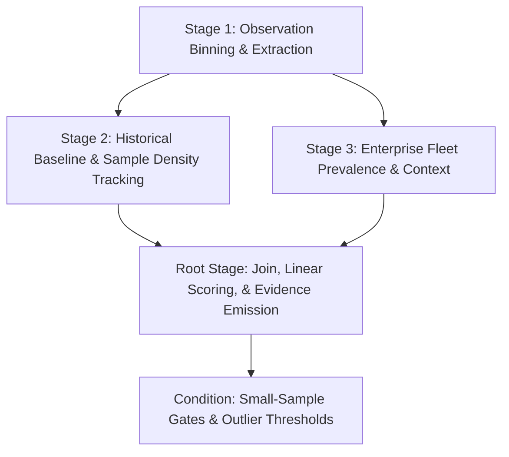

# SecOps Statistical Hunter — Statistical Models Taxonomy

This document outlines the mathematical models supported by `secops-statistical-hunter`, their physical adversary TTP mappings, the **Four-Stage DAG Pipeline Architecture**, and the **Semantic Sensitivity Tiers** to use when guiding non-practitioners.

---

## 1. Timing Jitter via Coefficient of Variation ($\text{CV}_{\Delta t}$)

* **Primary Adversary Behavior**: C2 Beaconing (Cobalt Strike, Sliver, Metasploit, Custom Implants), automated data synchronization, keep-alive polling.
* **Mathematical Formula**:
  $$\text{CV} = \frac{\sigma_{\Delta t}}{\mu_{\Delta t}}$$
  where $\Delta t_i = t_i - t_{i-1}$ is the time interval between consecutive network connections or requests.

### Sensitivity Tiers (`C2_BEACONING_JITTER`)

| Tier | Mathematical Boundary | Physical Interpretation | Recommended Secondary Filters |
| :--- | :--- | :--- | :--- |
| **`PRECISION`** | $\text{CV} \le 0.05$ | Hardcoded fixed interval ($\pm 3\%$ jitter). Robotic polling. | `min_conns >= 50, active_hours >= 12` |
| **`BALANCED`** | $\text{CV} \le 0.20$ | Standard default C2 sleep jitter ($15\%–20\%$ variance). | `fleet_prevalence <= 2, active_hours >= 6` |
| **`AGGRESSIVE`** | $\text{CV} \le 0.40$ | Heavily randomized C2 sleep intervals designed to evade basic detection. | `fleet_prevalence == 1, active_hours >= 3` |
| ❌ **`NOISE CLIFF`** | $\text{CV} > 0.50$ | Approaching Poisson randomness (normal web browsing). | **Refuse search.** |

---

## 2. Modified Z-Score via Median Absolute Deviation ($M_Z$)

* **Primary Adversary Behavior**: DNS Tunneling, DGA subdomain explosion, massive data exfiltration spikes.
* **Mathematical Formula**:
  $$\text{MAD} = \text{median}(|x_i - \tilde{x}|)$$
  $$M_Z = \frac{0.6745 \cdot (x_i - \tilde{x})}{\text{MAD}}$$
* **Why MAD over Standard $Z$-Score?**
  In security telemetry, a single massive exfiltration day ($100\text{ GB}$) inflates the standard deviation ($\sigma$) so much that $Z$-score drops below $2.0$. MAD is **breakdown-resilient up to $50\%$ outliers**, making it the premier metric for security volume anomalies.

### Sensitivity Tiers (`DATA_EXFILTRATION_SPIKE`)

| Tier | Mathematical Boundary | Physical Interpretation | Volume Floor Guardrail |
| :--- | :--- | :--- | :--- |
| **`PRECISION`** | $M_Z > 3.5$ | Top $\approx 0.05\%$ extreme distribution tail. Major operational event. | `MAD > 20, active_days >= 14` |
| **`BALANCED`** | $M_Z > 2.5$ | Top $\approx 2\%$ anomalies above personal entity median. | `MAD > 10, active_days >= 7` |
| **`AGGRESSIVE`** | $M_Z > 2.0$ | Top $\approx 5\%$ surges. Good for hunting stealthy data leakage. | `MAD > 5, active_days >= 3` |
| ❌ **`NOISE CLIFF`** | $M_Z < 1.5$ | Daily peak hour traffic fluctuations. | **Refuse search.** |

---

## 3. Parametric Historical Z-Score per Entity ($Z = (x - \mu) / \sigma$)

* **Primary Adversary Behavior**: Process launch storms, rapid batch lateral movement, ransomware staging, compiler abuse loops.
* **Mathematical Formula**:
  $$Z = \frac{x - \mu}{\sigma}$$
  where $x$ is the hourly/daily execution count for an entity, and $\mu, \sigma$ are the entity's historical mean and standard deviation across the baseline window.

### Sensitivity Tiers (`ZSCORE_PROCESS_SURGE`)

| Tier | Mathematical Boundary | Physical Interpretation | Variance Floor Guardrail |
| :--- | :--- | :--- | :--- |
| **`CONSERVATIVE`** | $Z > 3.0$ | 3-Sigma threshold (top $0.13\%$ distribution tail). Very low noise. | `stddev >= 10.0, obs >= 50, active_samples >= 120` |
| **`BALANCED`** | $Z > 2.0$ | 2-Sigma threshold (top $\approx 2.5\%$ distribution tail). Standard baseline sweep. | `stddev >= 5.0, obs >= 25, active_samples >= 60` |
| **`AGGRESSIVE`** | $Z > 1.5$ | 1.5-Sigma threshold (top $\approx 7\%$ distribution tail). Sensitive hunt. | `stddev >= 2.0, obs >= 10, active_samples >= 30` |
| ❌ **`NOISE CLIFF`** | $Z \le 1.0$ | Within standard daily operational variance. | **Refuse search.** |

---

## 4. Poisson Burstiness via Fano Factor ($F = \sigma^2 / \mu$)

* **Primary Adversary Behavior**: Password spraying, automated credential stuffing waves, intermittent lateral recon sweeps that stay under volume caps.
* **Mathematical Formula**:
  $$F = \frac{\sigma^2}{\mu}$$
  * $F < 1.0$: Robotic/Periodic timing.
  * $F \approx 1.0$: Memoryless Poisson process (random independent human errors).
  * $F > 4.0$: **Over-dispersed cluster attack waves** (burst activity).

### Sensitivity Tiers (`POISSON_BURST_CLUSTERING`)

| Tier | Mathematical Boundary | Physical Interpretation | Floor Guardrail |
| :--- | :--- | :--- | :--- |
| **`CONSERVATIVE`** | $F \ge 8.0$ | Severe synchronized attack downpours. | `min_fails >= 30, mu >= 2.0, active_hours >= 60` |
| **`BALANCED`** | $F \ge 4.0$ | Clear wave-like password spraying / recon pulses. | `min_fails >= 15, mu >= 1.0, active_hours >= 30` |
| **`AGGRESSIVE`** | $F \ge 2.5$ | Moderate clumping in authentication failures. | `min_fails >= 10, mu >= 0.5, active_hours >= 15` |
| ❌ **`NOISE CLIFF`** | $F \le 1.5$ | Independent random login typos. | **Refuse search.** |

---

## 5. Discrete Poisson Arrival Score ($\text{Poisson } Z = \frac{k - \lambda}{\sqrt{\lambda}}$)

* **Primary Adversary Behavior**: Sensitive administrative tool invocations (`vssadmin`, `certutil`, `whoami`, `dsquery`) on endpoints with near-zero baseline history.
* **Mathematical Formula**:
  $$\text{Poisson } Z = \frac{k - \lambda}{\sqrt{\lambda}}$$
  where $k$ is observed executions today, $\lambda$ is historical daily mean arrival rate, and theoretical standard deviation $\sigma = \sqrt{\lambda}$.

### Sensitivity Tiers (`POISSON_RARE_SURGE`)

| Tier | Mathematical Boundary | Physical Interpretation | Floor Guardrail |
| :--- | :--- | :--- | :--- |
| **`CONSERVATIVE`** | $\text{Poisson } Z \ge 5.0$ | Extreme mathematical impossibility on quiet host. | `k >= 5, lambda <= 1.0, active_days >= 14` |
| **`BALANCED`** | $\text{Poisson } Z \ge 3.5$ | Improbable jump in rare administrative execution. | `k >= 3, lambda <= 2.0, active_days >= 7` |
| **`AGGRESSIVE`** | $\text{Poisson } Z \ge 2.5$ | Noticeable uptick in low-frequency binary usage. | `k >= 2, lambda <= 3.0, active_days >= 3` |

---

## 6. Non-Parametric IQR / Tukey Fences

* **Primary Adversary Behavior**: Heavy-tailed egress data transfers, unusual file access counts.
* **Mathematical Formula**:
  $$\text{IQR} = Q_3 - Q_1$$
  $$\text{Upper Fence} = Q_3 + (1.5 \cdot \text{IQR})$$
  $$\text{Surge Ratio} = \frac{x_{\text{today}}}{\text{Upper Fence}}$$

---

## 7. Multi-Window Rolling Ratios ($1\text{d}$ vs $7\text{d}$ vs $30\text{d}$)

* **Primary Adversary Behavior**: Credential stuffing bursts, brute force authentication waves, sudden scan sweeps.
* **Mathematical Formula**:
  $$\text{Ratio}_{1v7} = \frac{S_{1\text{d}}}{\text{avg}_{7\text{d}}}, \quad \text{Ratio}_{1v30} = \frac{S_{1\text{d}}}{\text{avg}_{30\text{d}}}$$

---

## 8. Cross-Fleet Peer Normalization ($Z_{\text{fleet}} = (x_{\text{host}} - \mu_{\text{fleet}}) / \sigma_{\text{fleet}}$)

* **Primary Adversary Behavior**: Singular compromised host exceeding enterprise-wide peer population execution norms.
* **Mathematical Formula**:
  $$Z_{\text{fleet}} = \frac{x_{\text{host}} - \mu_{\text{fleet}}}{\sigma_{\text{fleet}}}$$

---

## 9. Small-Sample Protection, Adaptive Windowing & Fleet Scaling

### A. The Law of Small Numbers in Threat Hunting
Low-prevalence telemetry and small sample sizes make routine events look deceptively anomalous. To ensure high fidelity:
1. **Dynamic Sample Density Floors**: Scale sample density floors proportionally based on total window capacity ($\Delta T$). Never apply static 30-day thresholds to 24-hour or 48-hour hunts.
2. **First-Class Outcome: Insufficient Evidence**: Rather than forcing a false positive anomaly ranking when the denominator is too small, flag the entity as `INSUFFICIENT BASELINE EVIDENCE`.
3. **Dispersion Floor Protection**: Enforce non-zero variance floors ($\sigma \ge 5.0$, $\text{MAD} > 5.0$) to avoid divide-by-zero explosions on dormant endpoints.

### B. Adaptive Window Granularity Matrix
| Search Window Duration ($\Delta T$) | Tumbling Bucket Granularity | Total Intervals | Proportional Sample Density Floor ($\ge$) |
| :--- | :--- | :--- | :--- |
| **Intra-Day** ($\le 24\text{h}$, "today") | `by 10m` or `by 15m` | $96–144$ | $12–24$ active intervals |
| **Short Window** ($24\text{h}–7\text{d}$, "past 2 days", "this week") | `by 1h` | $48–168$ | $12$ (2d) to $48$ (7d) active hours |
| **Extended Window** ($7\text{d}–30\text{d}$, "this month", "past 30d") | `by 1h` or `by 1d` | $168–720$ / $7–30$ | $60$ (hourly) or $7$ (daily) active units |

### C. Multiple-Comparison & Fleet Scaling (Bonferroni Adjustment)
When hunting across a fleet of $N$ endpoints, testing $N$ hypotheses simultaneously increases the probability of false positives. Adjust significance thresholds dynamically:
$$Z_{\text{adj}} \approx \sqrt{2 \ln(N)}$$
* For $N = 100$ endpoints: $Z_{\text{adj}} \ge 3.03\sigma$
* For $N = 1,000$ endpoints: $Z_{\text{adj}} \ge 3.72\sigma$
* For $N = 10,000$ endpoints: $Z_{\text{adj}} \ge 4.29\sigma$

---

## 10. The Four-Stage DAG Pipeline Architecture

Complex statistical pipelines in Malachite use up to **4 named intermediate stages plus 1 unwrapped root stage (5 stages total)**:

### The Clean Materialization Barrier Rule
1. **Zero Intra-Stage Outcome Race Conditions**: Never define an outcome variable `$var` and immediately use it as an operand in another calculation within the same `outcome:` block.
2. **Decompose Across Stages**: Compute base metrics ($\mu$, $\sigma$, $\text{MAD}$, active units, square roots, fleet counts) in upstream stages.
3. **Or Compute in Event Filter Section**: Perform linear arithmetic (`$diff = $host.count - $base.mean`, `$z = $diff / $base.sd`) in the stage's events body before `match:`, then aggregate cleanly in `outcome:` via `max($z)`.

---

## 11. Malachite Function Catalog & Compiler Rules

YARA-L 2.0 supports a broad catalog of functions through its **Factory Function subsystem**:

| Module | Supported Functions | Where Allowed | Compiler Notes |
| :--- | :--- | :--- | :--- |
| **`math`** | `math.sqrt()`, `math.pow()`, `math.floor()`, `math.ceil()`, `math.abs()`, `math.log()`, `math.round()`, `math.random()` | `events:` & Stage Body | When used in `outcome:` inside a match window, must wrap aggregated event fields. |
| **`window`** | `window.median()`, `window.percentile()`, `window.stddev()`, `window.variance()`, `window.avg()`, `window.mode()`, `window.range()`, `window.first()`, `window.last()` | `outcome:` | Used for robust non-parametric baselines across historical buckets. |
| **`cast`** | `cast.as_int()`, `cast.as_float()`, `cast.as_string()`, `cast.as_uint()`, `cast.as_bool()` | `events:` & `outcome:` | Type coercion for epoch day arithmetic and strings. |
| **`strings`** | `strings.trim()`, `strings.split()`, `strings.substr()`, `strings.contains()`, `strings.reverse()`, `strings.to_lower()`, `strings.to_upper()`, `strings.concat()` | `events:` & Stage Body | Scalar string transformations on UDM fields. |
| **`re`** | `re.regex()`, `re.capture()`, `re.capture_all()`, `re.replace()`, `re.count()`, `re.count_distinct()` | `events:` & Stage Body | Regular expression extraction and filtering. |
| **`timestamp`** | `timestamp.get_hour()`, `timestamp.get_day_of_week()`, `timestamp.truncate()`, `timestamp.diff()`, `timestamp.current_seconds()` | `events:` & Stage Body | Seasonality and maintenance window modeling. |
| **`hash`** | `hash.sha256()`, `hash.sha512()`, `hash.md5()`, `hash.fingerprint2011()` | `events:` & Stage Body | Telemetry hashing and bucketing. |
| **Aggregates** | `count()`, `count_distinct()`, `approx_count_distinct()`, `sum()`, `avg()`, `stddev()`, `min()`, `max()`, `array()`, `array_distinct()`, `earliest()`, `latest()` | `outcome:` | **OutcomeLimit = 20** variables per section. Always use `array_distinct` for strings. |

